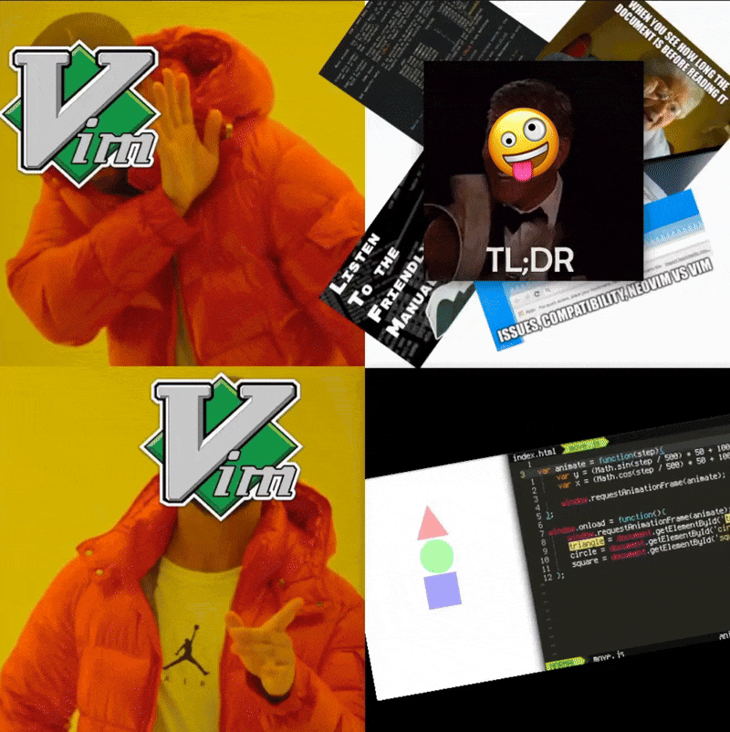
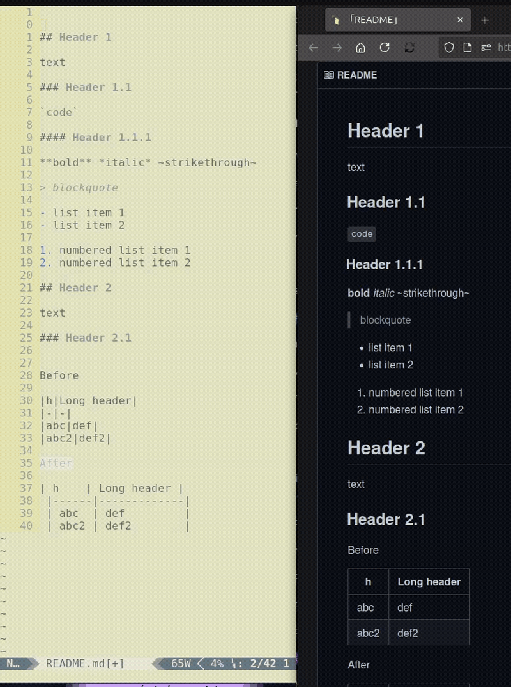
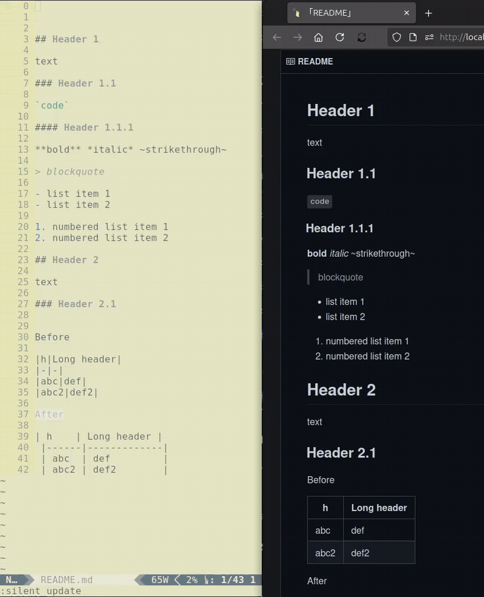
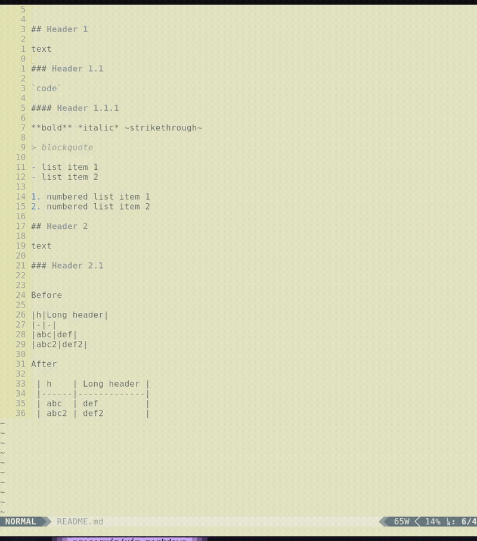
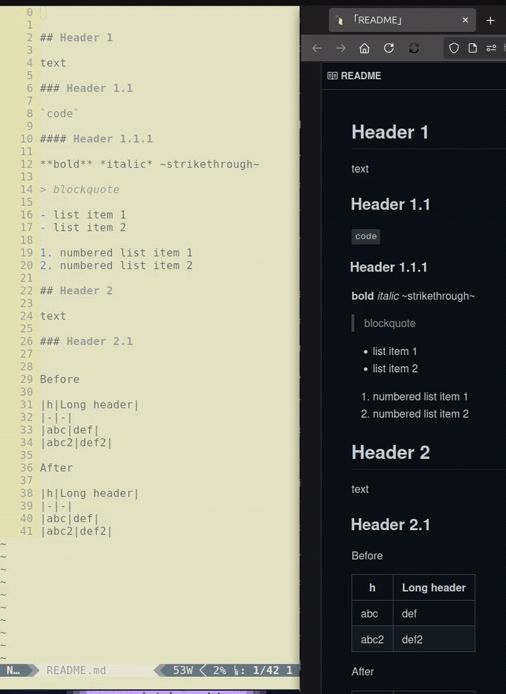
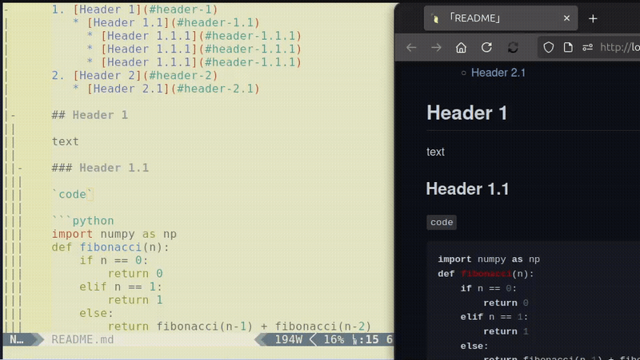
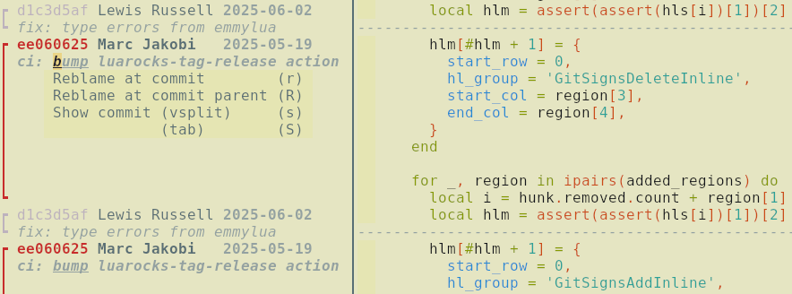
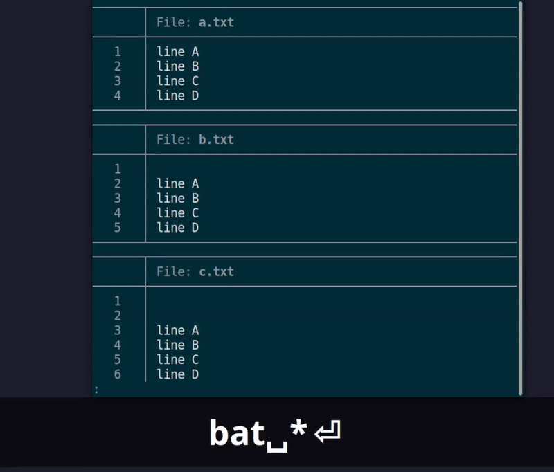
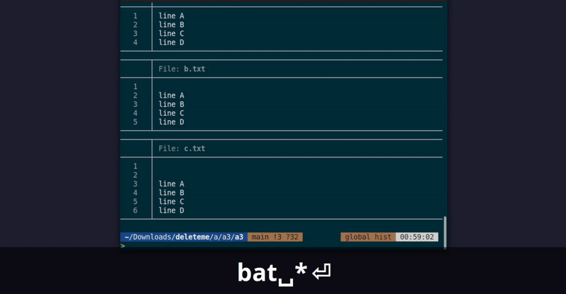

<div align="center">
  <a href="https://github.com/juanMarinero/vim-plugins-screenshots/pulls"></a>
  <a href="https://github.com/juanMarinero/vim-plugins-screenshots?tab=readme-ov-file#license"></a>
  
  
</div>
<br/>



> A picture is worth a thousand words

**🖼️ == 1000 x 📝**

Neo-/Vim has so many **plugins**! **Visually** check their **main features** here.

This is not a detailed list of all Neo/Vim plugins; for that, visit
- [vim.org](https://www.vim.org/scripts/script_search_results.php?keywords=&script_type=&order_by=downloads&direction=descending&search=search) sorted by downloads/rating
- [vimawesome.com](https://vimawesome.com/) sorted by rating
- [awesome-vim](https://github.com/akrawchyk/awesome-vim) grouped by section and alphabetically sorted
- [awesome-neovim](https://github.com/rockerBOO/awesome-neovim) for NeoVim
- [neovimcraft](https://neovimcraft.com/)
- [vim-plugin-list](https://github.com/altermo/vim-plugin-list) last maintained in 2024
- [dotfyle](https://dotfyle.com/)

<details>
  <summary><strong>Index</strong> - Click to expand</summary>

* [ALE](#ale)
* [prettier](#prettier)
* [coc.nvim](#cocnvim)
* [copilot.vim](#copilotvim)
* [codeium.vim](#codeiumvim)
* [vim-ai](#vim-ai)
* [cheat.sh-vim](#cheatsh-vim)
* [Ctags: tagbar](#ctags-tagbar)
* [Ctags: vista.vim](#ctags-vistavim)
* [emmet-vim](#emmet-vim)
* [jupyter-vim](#jupyter-vim)
* [jupytext (not a vim plugin)](#jupytext-not-a-vim-plugin)
* [jupyter_ascending](#jupyter_ascending)
* [vim-markdown](#vim-markdown)
* [markdown-preview](#markdown-preview)
* [vim-terminator](#vim-terminator)
* [codi.vim](#codivim)
* [vim-test](#vim-test)
* [vimspector debugger](#vimspector-debugger)
* [Snippets](#snippets)
  * [UltiSnips](#ultisnips)
  * [Coc-snippets](#coc-snippets)
  * [lexima.vim](#leximavim)
* [VimTex](#vimtex)
* [vim-latex-live-preview](#vim-latex-live-preview)
* [bracey.vim](#braceyvim)
* [git-signs](#git-signs)
  * [gitsigns.nvim](#gitsignsnvim)
  * [vim-gitgutter](#vim-gitgutter)
* [vim-fugitive](#vim-fugitive)
* [diffchar](#diffchar)
* [Git branch viewer](#git-branch-viewer)
  * [gv.vim](#gvvim)
  * [vim-flog](#vim-flog)
  * [gitgraph.nvim](#gitgraphnvim)
* [undotree](#undotree)
* [Visual Experience Enhancements](#visual-experience-enhancements)
  * [illuminate](#illuminate)
  * [vim-search-pulse](#vim-search-pulse)
  * [highlightedyank](#highlightedyank)
  * [GUI with vim-quickui](#gui-with-vim-quickui)
  * [rainbow](#rainbow)
* [Preview colors](#preview-colors)
  * [clrzr](#clrzr)
  * [nvim-colorizer.lua](#nvim-colorizerlua)
  * [colorizer](#colorizer)
* [vcoolor.vim](#vcoolorvim)
* [vim-surround](#vim-surround)
* [Indent Guides](#indent-guides)
   * [vim-indent-guides](#vim-indent-guides)
   * [indentline](#indentline)
   * [vim-indent-object](#vim-indent-object)
* [vim-matchup](#vim-matchup)
* [vim-visual-multi](#vim-visual-multi)
* [vim-signature](#vim-signature)
* [vim-bookmarks](#vim-bookmarks)
* [vim-codepainter](#vim-codepainter)
* [vim-mark](#vim-mark)
* [vim-simple-todo](#vim-simple-todo)
* [switch.vim](#switchvim)
* [File managers](#file-managers)
  * [NNN](#nnn)
  * [telescope-file-browser.nvim](#telescope-file-browsernvim)
  * [NERDTree](#nerdtree)
  * [Neo-tree.nvim](#neotreenvim)
  * [oil.nvim](#oilnvim)
  * [neovim-project](#neovim-project)
* [FZF](#fzf)
  * [fzf.vim](#fzfvim)
  * [fzf-preview.vim](#fzf-previewvim)
  * [fzf-lua](#fzf-lua)
  * [Telescope](#telescope)
  * [MRU](#mru)
  * [Ferret](#ferret)
  * [denite.nvim](#denitenvim)
* [vim-easymotion](#vim-easymotion)
* [CSV](#csv)
  * [csv.vim](#csvvim)
  * [Rainbow CSV](#rainbow-csv)
* [erd](#erd)
* [Recover.vim](#Recovervim)
* [NERDCommenter](#nerdcommenter)
* [VimDevIcons](#vimdevicons)
* [vim-json](#vim-json)
* [vim-airline](#vim-airline)
* [Tabs](#tabs)
  * [bufferline.nvim](#bufferlinenvim)
  * [barbar.nvim](#barbarnvim)
* [Registers](#registers)
  * [vim-peekaboo](#vim-peekaboo)
  * [vim-buffest](#vim-buffest)


At bottom:
- Hard to show screenshots like vim-repeat
- ToDo-s plugins like 🗄️ vim-dadbod ones

* [obsession-vim](#obsession-vim)
* [vim-workspace](#vim-workspace)
* [vim-execution](#vim-execution)
* [vim-repeat](#vim-repeat)
* [vim-dadbod](#vim-dadbod)
* [html5.vim](#html5vim)

* [Bonus](#bonus)

</details>

## ALE

https://github.com/dense-analysis/ale

<video autoplay="true" muted="true" loop="false" controls="true" src="https://user-images.githubusercontent.com/3518142/210141215-8f2ff760-6a87-4704-a11e-c109b8e9ec41.mp4" title="An example showing what ALE can do."></video>

See practical examples for Python and Javascript in the MWEs of [juanMarinero/vim-install-basic](https://github.com/juanMarinero/vim-install-basic#minimal-working-examples), first part of next [videos](https://github.com/juanMarinero/vim-install-basic/tree/main/videos).


## prettier

https://github.com/prettier/vim-prettier


## coc.nvim

https://github.com/neoclide/coc.nvim


## copilot.vim

🤖
https://github.com/github/copilot.vim


## codeium.vim 

🤖
https://codeium.com/vim_tutorial

https://github.com/Exafunction/windsurf.vim


## vim-ai

🤖
https://github.com/madox2/vim-ai


## cheat.sh-vim 

~🤖
https://gitlab.com/dbeniamine/cheat.sh-vim/ 

<p align="center">  </p>


## Ctags: tagbar

https://github.com/majutsushi/tagbar#screenshots 


## Ctags: vista.vim

https://github.com/liuchengxu/vista.vim

<p align="center">
    
    <p align="center">Vista ctags</p>
</p>


## emmet-vim

https://github.com/mattn/emmet-vim


## jupyter-vim

🐍 Send lines from Python script to qtconsole

https://github.com/jupyter-vim/jupyter-vim 

Video:
[](https://www.youtube.com/watch?v=h59cbg4HqpY)

## jupytext (not a vim plugin)

🐍 pip install jupytext: edit py files synced to the paired .ipynb

https://jupytext.readthedocs.io/


## jupyter_ascending

🐍 expand jupytext package. Automatic update ipynb file at save of py script. Also run cells.

https://github.com/imbue-ai/jupyter_ascending

https://github.com/imbue-ai/jupyter_ascending.vim


## vim-markdown

https://github.com/preservim/vim-markdown

<details>
  <summary><code>:HeaderIncrease</code> and <code>:HeaderDecrease</code> - Click to expand</summary>

  
</details>

<details>
  <summary><code>:InsertToc</code> and <code>:InsertNToc</code></summary>

  
</details>

<details>
  <summary><code>:Toc</code></summary>

  
</details>

<details>
  <summary><code>:TableFormat</code></summary>

  
</details>

<details>
  <summary>Mappings <code>]]</code> and <code>]u</code>. Check Python,javascript and TeX syntax highlight in <code>```</code> blocks</summary>

  
</details>


## markdown-preview

https://github.com/iamcco/markdown-preview.nvim


## vim-terminator

🐍,JS,... : run code in terminal, also REPL hunks

Ideal for quick testing js/C small code

For Python better just use: `qtconsole`

https://github.com/erietz/vim-terminator

Run the current file in the output buffer:


Run the current file containing errors for quick fixing:


Run the current file in a terminal:


Send text between delimiters to a REPL:


## codi.vim

🐍,JS,... interactive scratchpad {{{2

https://github.com/metakirby5/codi.vim 

The interactive scratchpad for hackers.


_Using Codi as a Python scratchpad through the
[shell wrapper](#shell-wrapper)_


## vim-test

https://github.com/vim-test/vim-test 


## vimspector debugger

🔍🪲

https://github.com/puremourning/vimspector 


See practical examples for Python and Javascript debugging in the MWEs of [juanMarinero/vim-install-basic](https://github.com/juanMarinero/vim-install-basic#minimal-working-examples), videos [here](https://github.com/juanMarinero/vim-install-basic/tree/main/videos).


## Snippets


### UltiSnips

https://github.com/sirver/ultisnips

### Coc-snippets

https://github.com/neoclide/coc-snippets


### lexima.vim

https://github.com/cohama/lexima.vim

Auto close parentheses and repeat by dot dot dot...


Check also [delimitMate](https://github.com/Raimondi/delimitMate).


## VimTex

https://github.com/lervag/vimtex


**Navigating sections**

Use `]]` to jump to the beginning of the next `\section`, `\subsection` or
`\subsubsection`, whichever comes first. Use `[[` to jump backward through
sections, and see the similar shortcuts `][` and `[]` in the VimTeX
documentation at `:help <Plug>(vimtex-][)` and `:help <Plug>(vimtex-[])`.


MUCH MORE in: https://github.com/lervag/vimtex/blob/master/VISUALS.md


## vim-latex-live-preview

https://github.com/xuhdev/vim-latex-live-preview


## bracey.vim

</> JS/CSS : live-preview

https://github.com/turbio/bracey.vim/ 


Even evaluate javascript on save


## git-signs

🐹 signcolumn Git un/-staged, new, removed,...

### gitsigns.nvim

NeoVim only
https://github.com/lewis6991/gitsigns.nvim

| Hunk Actions | Line Blame |
| --- | ----------- |
|  |  |

Features that vim-gitgutter lacks:

- To columnsign (`:Gitsigns toggle_signs`) add number-sign (`:Gitsigns toggle_numhl`)

  

- Git delta (add img of README de gitsigns) with cmd `:Gitsigns toggle_word_diff`

  

- Hunk reset

- Show blame of current buffer using `:Gitsigns blame`. Press `Enter` to reblame or show commit (`:Gedit`).

  

- Show blame information for the current line in popup with `:Gitsigns blame_line`.

  

- Show blame information for the current line in virtual text.

  

- Preview hunks inline with `:Gitsigns preview_hunk_inline`

  

- Preview hunks in popup with `:Gitsigns preview_hunk`

  

- Show hunks Quickfix/Location List

  


### vim-gitgutter

https://github.com/airblade/vim-gitgutter


## vim-fugitive 

https://github.com/tpope/vim-fugitive

- http://vimcasts.org/episodes/fugitive-vim---a-complement-to-command-line-git/
- http://vimcasts.org/episodes/fugitive-vim-working-with-the-git-index/
- http://vimcasts.org/episodes/fugitive-vim-resolving-merge-conflicts-with-vimdiff/
- http://vimcasts.org/episodes/fugitive-vim-browsing-the-git-object-database/
- http://vimcasts.org/episodes/fugitive-vim-exploring-the-history-of-a-git-repository/


## diffchar

https://github.com/rickhowe/diffchar.vim


## Git branch viewer

[Differences of branch viewers](https://github.com/rbong/vim-flog/blob/master/FAQ.md#what-are-the-differences-with-other-branch-viewers)


### gv.vim

https://github.com/junegunn/gv.vim


### vim-flog

https://github.com/rbong/vim-flog

Git branch viewer and [more](https://github.com/rbong/vim-flog/blob/master/EXAMPLES.md)


### gitgraph.nvim

https://github.com/isakbm/gitgraph.nvim


## undotree

https://github.com/mbbill/undotree 


## Visual Experience Enhancements

### illuminate

Highlight current word under the cursor

https://github.com/rrethy/vim-illuminate 

<!-- <video autoplay="true" muted="true" loop="false" controls="true" width="700px" src="https://github.com/user-attachments/assets/fc1487cf-aa19-4238-af23-ab1ac2f5744a" title="An example showing what ALE can do."></video> -->

https://github.com/user-attachments/assets/fc1487cf-aa19-4238-af23-ab1ac2f5744a


### vim-search-pulse

https://github.com/inside/vim-search-pulse


### highlightedyank

Highlight yanked region

https://github.com/machakann/vim-highlightedyank


### GUI with vim-quickui

https://github.com/skywind3000/vim-quickui


### rainbow

https://github.com/luochen1990/rainbow

Diff level of parentheses in diff colors


## Preview colors

🎨 

### clrzr

`if &termguicolors && has('textprop')`

https://github.com/BourgeoisBear/clrzr


### nvim-colorizer.lua

`if &termguicolors && has('nvim')`

https://github.com/norcalli/nvim-colorizer.lua


### colorizer

`if !&termguicolors`

https://github.com/lilydjwg/colorizer


## vcoolor.vim

🎨 

Color picker (to add RGB color)

https://github.com/kabbamine/vcoolor.vim 

In GNU/Linux it uses a simple GTK+ dialog via Zenity or Yad.

Click on the image for a short screencast of the v0.1.

[](https://www.youtube.com/watch?v=ZBJ_-Uxm55U)


## vim-surround

Add/replace delimiters like `{`,`(`,`"`,`'`,`<p>`,...

https://github.com/tpope/vim-surround/blob/master/doc/surround.txt

```
  Old text                  Command     New text ~
  "Hello *world!"           ds"         Hello world!
  [123+4*56]/2              cs])        (123+456)/2
  "Look ma, I'm *HTML!"     cs"<q>      <q>Look ma, I'm HTML!</q>
  if *x>3 {                 ysW(        if ( x>3 ) {
  my $str = *whee!;         vllllS'     my $str = 'whee!';
```


## Indent Guides

### vim-indent-guides

https://github.com/preservim/vim-indent-guides

For visually displaying indent levels


### indentline

For visually displaying indent levels

Not maintained!

https://github.com/yggdroot/indentline 


### vim-indent-object

Selects all lines with the same or greater indent level

Alike `%i` vmap of vim-matchup but for same **indent** level, **not** for matchup pairs (if-else-... or chars `(`,`{`...).

Visual maps:
- `ii`

https://github.com/urxvtcd/vim-indent-object

See https://asciinema.org/a/465213?autoplay=1


## vim-matchup

Extend vim's `%` key to language-specific words.

Much more than vim-indent-object.
For matchup pairs (if-else-... or chars `(`,`{`...). **Not neccesary** in same **indent** level.

https://github.com/andymass/vim-matchup

Normal maps: `%`, `g%`,...

Visual maps: `i%`, `a%`,...


## vim-visual-multi

E.g. to align by `=` 3 lines: 
 - cursor at start 1st line
 - `Ctrl-V`
 - `jj`
 - `\\c`
 - `f=`
 - `\\a` 

https://github.com/mg979/vim-visual-multi


See exercises: https://github.com/juanMarinero/vim-visual-multi-exercises.


## vim-signature

Marks improved: un/-set, loop, show all, markColumn,...

https://github.com/kshenoy/vim-signature

Alphabetical mark traversal and more:


## vim-bookmarks

https://github.com/mattesgroeger/vim-bookmarks


## vim-codepainter

Highlight anything (save in json to perserve after closing file)

https://github.com/lpinilla/vim-codepainter


## vim-mark

Multiple search highlight

https://github.com/inkarkat/vim-mark


## vim-simple-todo

https://github.com/vitalk/vim-simple-todo

```
[x] Create plugin
[x] Add helpful documentation
[x] Publish to GitHub
[ ] Spread the word
```


## switch.vim

https://github.com/andrewradev/switch.vim


Tip: map it to `let g:switch_mapping = "-"` to act like the `-` in [vim-fugitive](#vim-fugitive) `:Git` (with no arguments), previous `:Gstatus`, that enables to un-/stage files.

It can switch a lot:


<details>
<summary><code>[ ]</code> &harr; <code>[x]</code> in list of tasks</summary>

In a markdown like next

```md
- [x] Task 1
- [ ] Task 2
```

set your cursor in any part of the second lines (task 2) and:

- Run `:Switch`
- Or use the mapping `-` if defined (otherwise use the default plugin mapping `gs`)

Result: the  `[ ]` will switch to `[x]`.

Repeat again to switch back.

[References](https://github.com/andrewradev/switch.vim?tab=readme-ov-file#markdown).


Tip: use map `-` (or `gs`) instead of mapping of `<Plug>(simple-todo-mark-switch)` of [vim-simple-todo](https://github.com/vitalk/vim-simple-todo) if installed.
</details>


<details>
<summary><code>true</code> &harr; <code>false</code>, <code>True</code> &harr; <code>False</code>, <code>&&</code> &harr; <code>||</code></summary>

- To trigger these replacements first move the cursor over the word to replace.
[References](https://github.com/andrewradev/switch.vim?tab=readme-ov-file#global).
- To switch between booleans anywhere on the line and return to the original cursor position check [this](https://github.com/AndrewRadev/switch.vim/wiki/Switch-boolean-on-line-and-return).
</details>


<details>
<summary><code>pick</code> &rarr; <code>fixup</code> &rarr; <code>reword</code> &rarr; <code>edit</code> &rarr; <code>squash</code> &rarr; <code>exec</code> &rarr; <code>break</code> &rarr; <code>drop</code> &rarr; <code>label</code> &rarr; <code>reset</code> &rarr; <code>merge</code> &rarr; (loops back to <code>pick</code>)</summary>

[References](https://github.com/andrewradev/switch.vim?tab=readme-ov-file#git-rebase).
</details>


<details>
<summary><code>function example(one, two) { }</code> &harr; <code>var example = function(one, two) { }</code>, ES6 style <code>var example = function(one, two) { }</code> &harr; <code>var example = (one, two) => { }</code></summary>

[References](https://github.com/andrewradev/switch.vim?tab=readme-ov-file#javascript).
</details>


<details>
<summary>under_score &harr; camelCase</summary>

References: [this](https://github.com/AndrewRadev/switch.vim/blob/main/examples/example_underscores.vim) and [this](https://github.com/andrewradev/switch.vim?tab=readme-ov-file#nested-dict-definitions).

```vim
let g:switch_global_definitions_underscore_from_to_camel = [
  \   {
  \     '\<[a-z0-9]\+_\k\+\>': {
  \       '_\(.\)': '\U\1'
  \     },
  \     '\<[a-z0-9]\+[A-Z]\k\+\>': {
  \       '\([A-Z]\)': '_\l\1'
  \     },
  \   }
  \ ]
```

Tip: use another map, like `-c` , to no overshadow the global *switch.vim* rule (*definitions*) of `g:switch_custom_definitions`. Read [Customization](https://github.com/andrewradev/switch.vim?tab=readme-ov-file#customization).

```vim
nnoremap -c :call switch#Switch({'definitions': g:switch_global_definitions_underscore_from_to_camel})<CR>
```
</details>


## File managers

### NNN

https://github.com/mcchrish/nnn.vim

<video autoplay="true" width="800px" muted="true" loop="false" controls="true" src="https://user-images.githubusercontent.com/7200153/127453278-3e638e33-707a-49c8-b34e-225c225906b1.mov" title="An example showing what ALE can do."></video>


### telescope-file-browser.nvim

See [Telescope](#telescope)

For creation, deletion, renaming, and moving of files and folders.


### NERDTree

https://github.com/preservim/nerdtree


### Neo-tree.nvim

https://github.com/nvim-neo-tree/neo-tree.nvim


### oil.nvim

https://github.com/stevearc/oil.nvim

https://user-images.githubusercontent.com/506791/209727111-6b4a11f4-634a-4efa-9461-80e9717cea94.mp4


### neovim-project

https://github.com/coffebar/neovim-project


[⚙️ Configuration](https://github.com/coffebar/neovim-project?tab=readme-ov-file#%EF%B8%8F-configuration)

```lua
{
  -- Project directories
  projects = {
    "~/projects/*",
    "~/p*cts/*", -- glob pattern is supported
    "~/projects/repos/*",
    "~/.config/*",
    "~/work/*",
  },
  ...
}
```

## FZF

### fzf.vim 

Find files/dirs/cmds quickly

https://github.com/junegunn/fzf.vim

https://github.com/junegunn/fzf/blob/master/README-VIM.md#fzf

### fzf-preview.vim

https://github.com/yuki-yano/fzf-preview.vim#features


### fzf-lua

https://github.com/ibhagwan/fzf-lua


### Telescope

https://github.com/nvim-telescope/telescope.nvim


### MRU

Most-Recently Used files. FZF results with `:FZFMru`

https://github.com/yegappan/mru


### Ferret

https://github.com/wincent/ferret

Multi-file search.


Alternative with `:RG` of [fzf.vim](https://github.com/junegunn/fzf.vim) and `:cnext`/`:cprevious`




Or in terminal via *ripgrep-all* + *FZF* as [here](https://github.com/phiresky/ripgrep-all/issues/207#issuecomment-3040402334)




Recommended: [Vim Search and Replace With Examples](https://thevaluable.dev/vim-search-find-replace/) by [The Valuable Dev](https://thevaluable.dev/)


### denite.nvim

https://github.com/Shougo/denite.nvim

> It is like a fuzzy finder, but is more generic.


## vim-easymotion

https://github.com/easymotion/vim-easymotion

1. Type `<Leader><Leader>w` to trigger the word motion w
2. When the motion is triggered the text is updated as 

[Source](https://code.tutsplus.com/tutorials/vim-essential-plugin-easymotion--net-19223)
3. E.g. press `b` to jump to the beginning of the word *function* in line 6

Multi-window inc-search


[fuzzy-search](https://github.com/easymotion/vim-easymotion#bonus-fuzzy-search-with-easymotion), etc.

If with `/`, `?` or `g/` you cannot paste using `C-V`, then check out [this](https://github.com/haya14busa/incsearch.vim/issues/158#issuecomment-2968041038).


## CSV

### csv.vim

https://github.com/chrisbra/csv.vim


### Rainbow CSV

https://github.com/mechatroner/rainbow_csv


## erd

https://github.com/burntsushi/erd

Convert a Relational Database Schema to a graphical Entity-Relationship Diagram (ERD).

[](https://raw.githubusercontent.com/BurntSushi/erd/master/examples/nfldb.png)

Alternatives: 
[various](https://github.com/burntsushi/erd?tab=readme-ov-file#similar-software), 
[erdplus](https://erdplus.com/), 
[MySQL Workbench](https://www.mysql.com/products/workbench/),...


## Recover.vim

https://github.com/chrisbra/Recover.vim  adds `[C]ompare` entry to the list of actions, like this:

```
Found a swap file by the name "test/normal/.testfile.swp"
        owned by: chrisbra   dated: Wed Nov 28 16:26:42 2012
        file name: ~chrisbra/code/git/vim/Recover/test/normal/testfile
        modified: YES
        user name: chrisbra   host name: R500
        process ID: 4878 [not existing]
While opening file "test/normal/testfile"
            dated: Tue Nov  6 20:11:55 2012
Please choose:
[C]ompare, (O)pen Read-Only, (E)dit anyway, (R)ecover, (Q)uit, (A)bort, (D)elete:
```


## NERDCommenter


https://github.com/preservim/nerdcommenter#default-mappings

[GIFs](https://qiita-com.translate.goog/pepo/items/09bacf98a36f6a7285ac?_x_tr_sl=auto&_x_tr_tl=en)


## VimDevIcons

https://github.com/ryanoasis/vim-devicons/wiki/Installation

See https://github.com/ryanoasis/vim-devicons/wiki/screenshots


## vim-json

https://github.com/elzr/vim-json

Distinct highlighting of keywords vs values, JSON-specific (non-JS) warnings, quote concealing.

| conceallevel=0 | conceallevel=2 |
| --- | --- |
|  |  |


## vim-airline

https://github.com/vim-airline/vim-airline


## Tabs

### bufferline.nvim

https://github.com/akinsho/bufferline.nvim


### barbar.nvim

https://github.com/romgrk/barbar.nvim


## Registers

### vim-peekaboo

https://github.com/junegunn/vim-peekaboo


Peekaboo extends `"` and `@` in normal mode and `<CTRL-R>` in insert mode so
you can see the contents of the registers.


### vim-buffest

https://github.com/rbong/vim-buffest

Easily edit vim registers/macros and lists as buffers.


----
----


## obsession-vim

Update mksession automatic

https://github.com/tpope/vim-obsession


## vim-workspace

Auto create mksessions per dir

https://github.com/thaerkh/vim-workspace


## vim-execution

Select line and run `@[macro]` instead of :`'<,'>normal @[macro]`

https://github.com/rnevius/vim-execution


## vim-repeat

Use `.` with not only native cmds (with `<Plug>` too)

https://github.com/tpope/vim-repeat


## vim-dadbod 

🗄️ DB interface
https://github.com/tpope/vim-dadbod

🗄️ vim-dadbod-ui
https://github.com/kristijanhusak/vim-dadbod-ui

🗄️ vim-dadbod-completion
https://github.com/kristijanhusak/vim-dadbod-completion


## html5.vim

Fix HTML indent

https://github.com/othree/html5.vim 


----
----
## Bonus

- Neo/Vim itself can be tricky to install, check out:
  - The [official Vim docs](https://vimdoc.sourceforge.net/) or directly [this](https://vimdoc.sourceforge.net/htmldoc/usr_90.html)
  - The [official NeoVim docs](https://neovim.io/doc/user/intro.html#_installing-nvim)
  - For Ubuntu users I promote myself (both Vim and NeoVim): [juanMarinero/vim-install-basic](https://github.com/juanMarinero/vim-install-basic)
  - Neo/Vim preconfigured with [NvChad](https://nvchad.com/docs/quickstart/install), [LazyVim](https://www.lazyvim.org/), [AstroNvim](https://astronvim.com/), [SpaceVim](https://github.com/wsdjeg/SpaceVim), [The Ultimate vimrc](https://github.com/amix/vimrc), [spf13-vim](https://github.com/spf13/spf13-vim),...
- [ALE](#ale), [coc.nvim](#cocnvim) and [vimspector-debugger](#vimspector-debugger) are essential Vim plugins.
But not easy to configure. Take a look at [juanMarinero/vim-install-basic](https://github.com/juanMarinero/vim-install-basic), for example for [ALE](https://github.com/juanMarinero/vim-install-basic/tree/main/plugins/ale).
- Other plugins are difficult to master. For example [vim-visual-multi](#vim-visual-multi) requires some practice. Check out [juanMarinero/vim-visual-multi-exercises](https://github.com/juanMarinero/vim-visual-multi-exercises)

----
----

## License

**GPLv3** or later.
This project is primarily licensed under the [GNU General Public License (GPL) version 3](https://www.gnu.org/licenses/gpl-3.0.en.html#license-text) or later.
See the local copy [LICENSE](./LICENSE).

### Media Attribution and Licensing

This educational repository contains screenshots and other media derived from various Vim and NeoVim plugins.
These materials are used for illustrative and educational purposes under the following conditions:

1. **Plugin media**:
   - Each screenshot and other media retain the original license of the respective Vim (or NeoVim) plugin
   - Source attribution is provided either:
     - Directly following the media link
     - In the respective plugin repository's documentation (repository links are provided for each plugin).

2. **Original Content**:
   - All original written content, documentation, and any media not derived from plugin or third-party sources are licensed under GPLv3+
   - These media files are stored locally in this repository
   - If any content is partially based on other sources, a corresponding text file with the same name (homonym) will be provided to indicate the original sources.

3. **Third-party Content** (non-plugin sources):
   - Only content that is neither from plugins nor original will have a *Source* link
   - Users are responsible for verifying the license of any third-party content

### Compliance Notice

Users of this repository must:
- Verify the license of any plugin before using its screenshots
- Provide proper attribution when reusing any media
- Contact the respective plugin authors if unsure about license compliance

For any questions regarding licensing, please open an issue in this repository.
